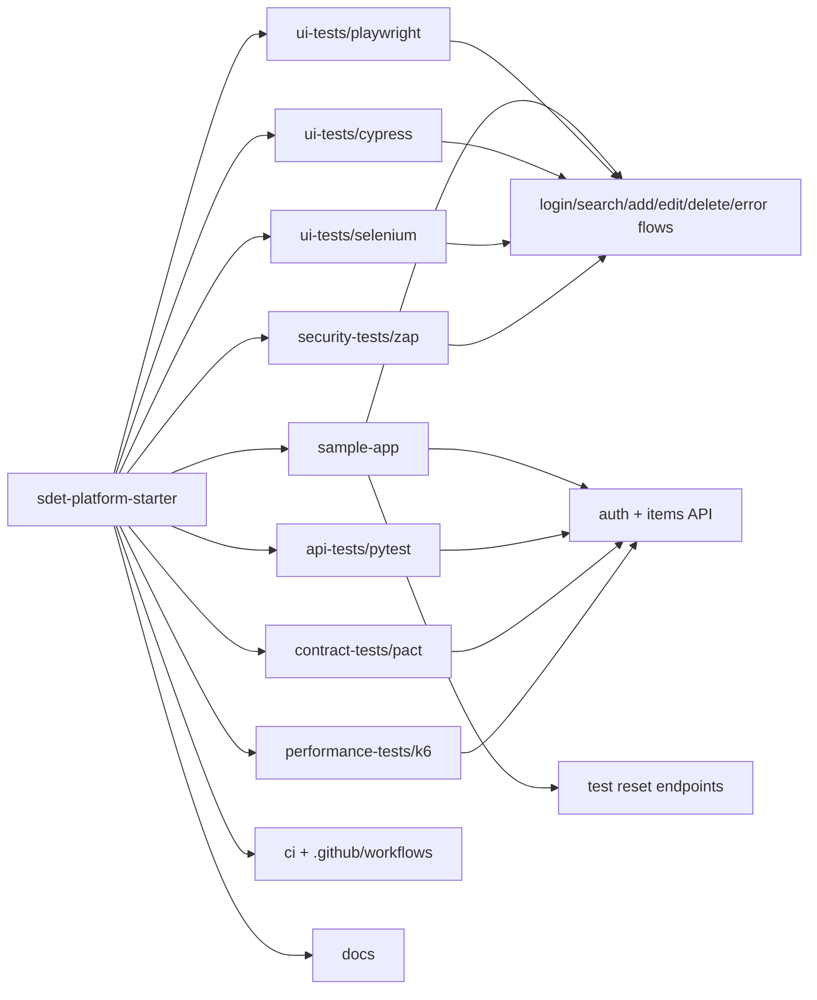

# sdet-platform-starter

Production-style SDET portfolio monorepo showcasing modern quality engineering across UI automation, API testing, contract verification, performance testing, security scanning, Dockerized execution, and CI/CD design.

**Primary stack:** Playwright, Cypress, Selenium, pytest, TypeScript, Python, Pact, k6, OWASP ZAP, Docker, GitHub Actions, Buildkite, AWS-ready CI

Built for hiring managers and engineering leaders reviewing a mid-level SDET portfolio. The repository uses one shared demo target and demonstrates how browser, API, contract, performance, security, and delivery concerns fit together in a practical automation platform.

## What this repository demonstrates

- Playwright as the primary browser automation stack with page objects, fixtures, retries, traces, and HTML reporting
- Secondary browser coverage with Cypress and Selenium to show practical range across toolchains
- API automation in Python with pytest, `requests`, schema validation, parametrization, and data factories
- Pact-based consumer/provider contract testing that fits a CI/CD workflow
- k6 performance scripts for smoke, load, and stress scenarios
- OWASP ZAP baseline scanning support with safe-usage guidance
- Docker Compose execution for a local app-plus-smoke-suite workflow
- GitHub Actions, Buildkite, and AWS CodeBuild examples for delivery automation
- Recruiter-friendly documentation focused on engineering tradeoffs, scaling, and operational realism

## Architecture



See [architecture.md](docs/architecture.md) for a more explicit breakdown.

## Repository layout

| Path | Purpose |
| --- | --- |
| `sample-app` | Local demo target with UI and API flows used by every automation layer |
| `ui-tests/playwright` | Flagship browser automation stack |
| `ui-tests/cypress` | Secondary browser coverage with custom commands and intercepts |
| `ui-tests/selenium` | Legacy-style browser automation with Python and explicit waits |
| `api-tests/pytest` | Service-layer validation with schema and business-rule assertions |
| `contract-tests/pact` | Consumer/provider contract examples |
| `performance-tests/k6` | Load, smoke, and stress scripts |
| `security-tests/zap` | Baseline security scan wrapper and rules tuning |
| `shared-utils` | Common scripts and seeded test data references |
| `docker` | Container definitions for the app and smoke runner |
| `ci` | Buildkite, CodeBuild, and shared CI scripts |
| `docs` | Architecture, strategy, debugging, AWS, and roadmap documentation |
| `portfolio-projects` | Additional SDET project tracks to expand the GitHub portfolio |

## Demo target

The sample app is a deliberately small but realistic inventory workflow:

- login with seeded credentials
- search seeded inventory
- add item
- edit item
- delete item
- negative paths such as invalid login, duplicate item names, validation failures, and missing records

It uses stable `data-testid` selectors and deterministic reset endpoints so the automation remains parallel-safe and CI-friendly.

## Framework comparison

| Framework | Role in the repo | Why it matters |
| --- | --- | --- |
| Playwright | Primary UI automation | Modern engineering standard, rich diagnostics, strong CI fit |
| Cypress | Secondary UI coverage | Shows familiarity with frontend-team tooling and network intercepts |
| Selenium | Legacy/enterprise support | Demonstrates breadth beyond the newest stack |
| pytest + requests | API testing | Clean Python abstractions and readable assertions |
| Pact | Contract testing | Shift-left compatibility between consumer and provider |
| k6 | Performance | Code-driven thresholds and trend-friendly load scripts |
| OWASP ZAP | Security | Practical baseline scanning support in the SDLC |

See [framework-comparison.md](docs/framework-comparison.md) for tradeoffs.

## Quick start

### Prerequisites

- Node.js 20+
- Python 3.11+
- Docker Desktop or Docker Engine
- `make`
- Optional: `k6`

### Local setup

```bash
cp .env.example .env
python3 -m venv .venv
source .venv/bin/activate
make bootstrap
```

### Start the demo target

```bash
make dev
```

### Run the core smoke path

```bash
make smoke
```

### Run individual suites

```bash
make test-api
make test-playwright
make test-cypress
make test-selenium
make test-contract
k6 run performance-tests/k6/load.js
bash security-tests/zap/run-baseline.sh http://localhost:3000
```

### One-command Docker smoke execution

```bash
make docker-smoke
```

That command starts the sample app in Docker and runs API smoke plus Playwright smoke against it.

## CI/CD approach

### GitHub Actions

- `pr.yml`: lint, API smoke, and Playwright smoke for fast pull request feedback
- `main.yml`: broader API regression, Playwright regression, Cypress, Pact, and Docker smoke
- `nightly-regression.yml`: longer-running Playwright and Selenium coverage

### Buildkite

[pipeline.yml](ci/buildkite/pipeline.yml) mirrors the same philosophy with explicit artifact retention and gated steps.

### AWS / CodeBuild

[buildspec.yml](ci/codebuild/buildspec.yml) shows how the repository can run in CodeBuild with optional S3 artifact publishing.

## Testing strategy

### Smoke vs regression vs contract vs performance

- `smoke`: shortest path to verify service health and critical user journeys
- `regression`: broader CRUD, validation, search, and negative-path coverage
- `contract`: validates API compatibility promises between a consumer client and the provider
- `performance`: validates latency and stability thresholds under controlled pressure
- `security`: captures baseline web findings early and consistently

### Flaky-test mitigation strategy

- reset shared data before mutating tests
- use stable `data-testid` selectors
- prefer observable waits over sleeps
- keep tests independent and parallel-safe
- surface diagnostics automatically on failure

### Debugging and root-cause workflow

- verify the sample app is healthy
- rerun the smallest relevant suite
- inspect Playwright traces, screenshots, API payloads, or ZAP findings
- determine whether the failure is product, environment, or test code
- only add retries once the failure mode is understood

See [debugging-guide.md](docs/debugging-guide.md).

## Quality engineering principles

- shift quality left through contracts, schemas, and pull-request automation
- keep environment configuration explicit
- treat test data as a first-class design concern
- make failure artifacts easy to consume in CI
- choose practical simplicity over framework sprawl

## AWS-ready structure

This repository is designed to translate cleanly into container-based infrastructure:

- environment config via `.env.example`
- secret-handling guidance for AWS Secrets Manager / Parameter Store
- CodeBuild example under `ci/codebuild`
- optional S3 artifact publishing hook
- Docker-first execution path for ECS, EKS, or self-hosted runners

See [aws-ready.md](docs/aws-ready.md).

## Additional SDET Projects

The starter repo is the main centerpiece, but it now also includes expansion tracks under `portfolio-projects/`:

- `mobile-device-automation`: Appium, device-cloud execution, and mobile release coverage
- `accessibility-quality-gates`: accessibility automation and CI policy enforcement
- `data-pipeline-quality`: analytics and platform data validation
- `microservices-reliability`: contract, resilience, and distributed-systems quality

See [portfolio-projects/README.md](portfolio-projects/README.md).

## How this scales in a real company

- replace the in-memory sample app with a service backed by ephemeral environments
- split suites by domain, risk profile, or ownership
- publish contracts and quality metrics centrally
- add component, integration, and synthetic monitoring layers
- standardize artifacts for triage and quality trend reporting

## Additional docs

- [testing-strategy.md](docs/testing-strategy.md)
- [test-operations-notes.md](docs/test-operations-notes.md)
- [tradeoffs.md](docs/tradeoffs.md)
- [adr/README.md](docs/adr/README.md)
- [framework-comparison.md](docs/framework-comparison.md)
- [debugging-guide.md](docs/debugging-guide.md)
- [aws-ready.md](docs/aws-ready.md)
- [roadmap.md](docs/roadmap.md)
- [portfolio-projects/README.md](portfolio-projects/README.md)
