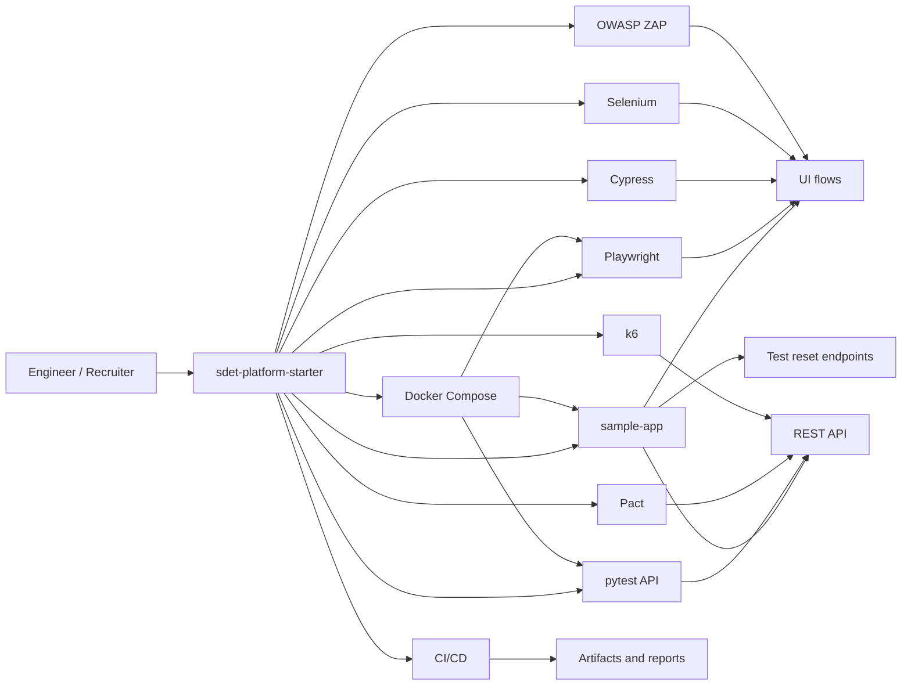

# Architecture

## Design choices

- One shared sample target keeps the repository coherent and makes cross-framework comparisons credible.
- Playwright is treated as the primary stack because it best reflects current market expectations for modern UI automation.
- Cypress and Selenium are intentionally smaller. They demonstrate range without duplicating the entire Playwright suite.
- State reset endpoints are exposed only for controlled test environments and make the repo deterministic enough for CI, contract, and performance layers.
- The repository prefers simple local execution over a heavy platform abstraction layer.

